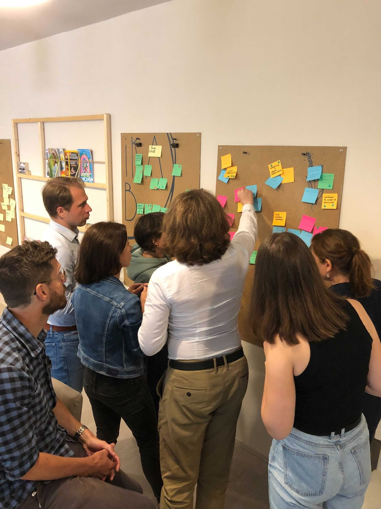
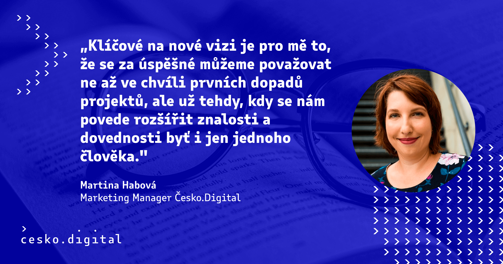

## Proč jsme se rozhodli změnit směr a vizi

### Eva Pavlíková, CEO

Když Česko.Digital Jakub Nešetřil zakládal, jeho myšlenka byla jednoduchá. V Česku máme spoustu šikovných technických lidí, kteří ve svém volném čase mají chuť programovat na straně jedné, a neziskové organizace a veřejná správa, kteří potřebují pomoc s digitalizací a inovací na straně druhé. Pojďme tedy tyto dva světy propojit v komunitě Česko.Digital a můžeme neziskových organizacím a veřejné správě s programováním pomoct.

Postupem času se ukázalo, že hypotéza je správná, ale naši pomoc je potřeba směřovat jiným způsobem – nejen programováním. Velmi málo organizací má připravené zadání k programování, někdy chovají k technologiím nedůvěru nebo si potřebují teprve urovnat myšlenky, s čím přesně potřebují pomoct.

Důležitá pro nás také byla intenzivní zpětná vazba od našich dlouhodobých členů, kteří silně vnímali tlak na výkon a dodávky projektů a sami Česko.Digital přirovnávali k digitální agentuře. 

Dnes tedy procházíme změnou od digitální agentury do akcelerátoru lidí a projektů, protože lidé jsou srdcem komunity a jejich podpora a rozvoj (stejně jako projektů) nám na srdci leží nejvíc.

## Jak jsme si nastavili cíle a novou metodiku

### Tomáš Walek, CDO

Nová vize Česko.Digital s sebou přináší i změny v metodice pro nastavování strategických cílů. Česko.Digital přešlo na populární metodiku OKR. Popis metodiky a jejího zavádění uvnitř Česko.Digital a konkrétní seznam cílů a klíčových výsledků je možné nalézt na [naší Confluence stránce](https://cesko-digital.atlassian.net/wiki/spaces/CD/pages/790102026/Metodika+OKR).

Leadership tým Česko.Digital nadefinoval dlouhodobé cíle a klíčové výsledky pro celou organizaci. Ty se ve zkratce zaměřují na:

* zvýšení úspěšnosti zapojení dobrovolníků do nabízených příležitostí: Devět z deseti lidí, kteří hledají dobrovolnickou příležitost, ji budou schopni najít. Příležitost by měla odpovídat zájmům a senioritě dobrovolníka.
* růstu kompetencí zapojených dobrovolníků: Každý dobrovolník, který se zapojí do aktivit Česko.Digital, tím posiluje své kompetence a získává nové zkušenosti, nezávisle na senioritě.
* úspěšnost obsazování nabízených dobrovolnických pozic: Chceme zajistit, abychom byli úspěšnější v hledání dobrovolníků do poptávaných rolí a tím zvýšili povědomí o Česko.Digital mezi zadavateli příležitostí. Zvýšením povědomí o Česko.Digital dosáhneme zvýšení počtu a kvality nabízených příležitostí, čímž rovněž podpoříme zvýšení úspěšnosti zapojení dobrovolníků. 
* změnu vnímání dobrovolníků a veřejnosti o Česko.Digital z digitální agentury do akcelerátoru lidí a kompetencí: Došli jsme k závěru, že jako digitální agentura můžeme způsobit jen omezený dopad na společnost kolem nás. Zároveň vnímáme, že výrazně většího dopadu dosáhneme tím, že budeme akcelerovat digitální kompetence celé společnosti a proměníme tak Česko k lepšímu místu pro život.

Co se týče plnění organizačních cílů, vytvořili jsme v rámci Česko.Digital 3 podtýmy, které se soustředí na různé cílové skupiny dobrovolníků dle míry zapojení.

1. Tým Engagement se zaměřuje primárně na followery, fanoušky a konzumenty obsahu Česko.Digital.
2. Tým Dobro on board se zaměřuje na krátkodobě zapojené dobrovolníky a pravidelně zapojené dobrovolníky – specialisty. 
3. Poslední tým Masters se zaměřuje na cílovou skupinu, která by se mohla stát ambasadory Česko.Digital, tj. mentory, kouče, agilní a kompetenční leadery a zadavatele projektů z řad neziskových organizací.

Všechny 3 týmy jsou složeny z členů kmenového týmu Česko.Digital a vybraných dobrovolníků – zástupců konkrétních cílových skupin. Věříme, že vytvořením tří týmů dle různých cílových skupin dokážeme lépe a přesněji reagovat na požadavky a nároky těchto cílových skupin, které se od sebe významně odlišují, a že tak významně přispějeme k naplnění nové vize organizace.

## „Aha“ momenty z workshopů, kde vznikala nová vize

### Tomáš Znamenáček, CTO

Debaty o vizi organizace jsem se zúčastnil poprvé, takže to pro mě byla celkově fascinující (a trochu děsivá) „cesta tam a zase zpátky“. Jako rozložit fungující auto na prvočinitele a následně z něj znovu poskládat něco, co nejenže opět funguje, ale v ideálním případě funguje lépe.

Velká zkušenost je pro mě nejen to, že něco takového vůbec jde udělat, ale zejména to, jak moc je to potřeba – nenechat organizaci růst jako dřevo v lese, ale mluvit pravidelně, cíleně a velmi konkrétně o tom, co přesně má vyrůst (a co ne).

Je pro mě velká zkušenost, jak moc se tým lidí s velmi podobnými hodnotami a motivacemi může pod povrchovým dojmem jasné shody ve skutečnosti rozcházet a nakolik je – opět! – potřeba o věcech cíleně a konkrétně mluvit, aby naše porozumění nebylo jen povrchové, ale skutečné. A stejně tak je pro mě velká zkušenost, že diverzita v týmu je naprosto žádoucí kvalita, která ovšem vyžaduje odpovídající péči, aby byla zdrojem vzájemného obohacování a nikoliv zdrojem vzájemných nedorozumění.

Jsem moc rád, že se nám v rámci strategického workshopu podařilo odkrýt větší plochu pro zapojování dobrovolníků a obecně propojování různých stran zapojených do tématu digitalizace – a programátor ve mně doufá, že se nám podařilo zvolit vhodnou „míru abstrakce“, tedy trefit dostatečně kompaktní a obecnou definici toho, co máme dělat, aby Česko bylo víc Digital.

### Romana Pokorná, CDO

Změna vize či nastavování OKR je aktivita náročná na čas, proto jsme si na setkání vyhradili celé dva dny. Ukázalo se, že šlo o naivní představu a nakonec jsme se potřebovali sejít ještě 2x, aby celý tým mohl procesem projít a dospěli jsme ke kýženým výstupům.

Naše očekávání bylo, že nám facilitované workshopy pomůžou se zúžením aktivit a koncentrací na ty nejpřínosnější pro naši komunity a partnery. Změna je ale i bolestivá a přináší nepříjemné věci jako výměnu členů týmu, kteří se s novým směřováním jednoduše neztotožňují a spolupráce by už nebyla oboustranně přínosná.

Přestože máte skvělého facilitátora, je potřeba být v rámci designu workshopu proaktivní a stát se také jeho tvůrcem. Protože jedině vy víte, co si potřebujete odnést a co jsou nejpalčivější témata na diskuzi.

Někdy je také třeba témata odlehčit a mít i stmelující aktivity jako společný oběd, kávu či drink po dlouhém dni, abyste odcházeli s pozitivními emocemi.

## Jaké jsou klíčové myšlenky nové vize?

### Tereza Gagnon, Head of Partnership & Fundraising

V průběhu setkání jsme se zaměřili na validaci naší mise, vize a strategie. V rámci diskusí byl pro mě zásadní obrat z pohledu dopadu, kde jsme se shodli, že je potřeba doplnit větší pozornost na naši komunitu.

V minulosti jsme často úzkým zaměřením na projekty nedávali tolik pozornosti celkovému kontextu, kde celkový dopad naší civic-tech organizace netvoří jen výsledky projektů, ale také nové zkušenosti expertních dobrovolníků. Ti přicházejí z komerčních firem, ale i státní správy, z intenzivní spolupráce s neziskovými a odbornými organizacemi (přes 200 organizací), a také od partnerů, ať už to byli dárci nebo firmy, které se v rámci CSR zapojili v různých formách (přes 100 komerčních firem).

Celkový dopad našich aktivit tvoří právě tato otevřenost a synergie. Snažíme se navíc naše aktivity nedržet izolované ani do budoucna a daří se nám již iniciovat i systémové změny, ve spolupráci se státem řízenými organizacemi.

Součástí nové strategie, tedy kroků, díky kterým směřujeme k naší stále platné vizi, je podpora jak komunity expertů, tak široká spolupráce v rámci klíčových témat, kterými jsou vzdělávání, zdraví a digitální stát, ale i další specifická technická témata, jako je open source, open data, UX, projektové řízení, atd. 

Do budoucna proto chystáme rozšířit plán příležitostí a sdílení know-how napříč naší komunitou, ale i externě – pomocí eventů, workshopů, labů, online stream diskusí a všech možných formátů, které nám situace dovolí.

### Martina Habová, Marketing Manager

Vnímala jsem Česko.Digital hlavně jako „spoludoručovatele“ projektů. Při představení dobrovolnické pyramidy jsem si uvědomila, že většinu energie jsme zaměřovali na její špičku – tedy právě dlouhodobě aktivní dobrovolníky a dodávání aktivit na projektech. 

S tím souvisí i to, že chceme posunout vnímání Česko.Digital od dodavatele projektů na akcelerátor lidí a projektů.

##### *Titulek a perex: Terézia Palaščáková*

##### *Korektura: Petr Hrudka*