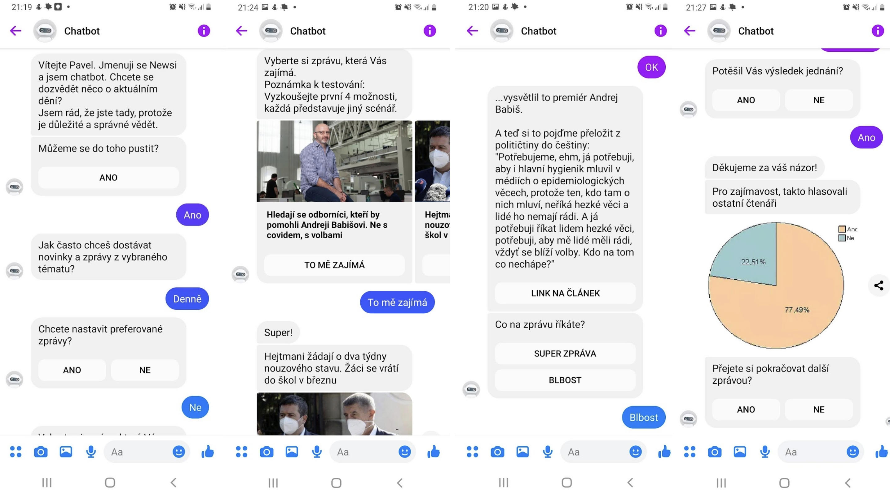
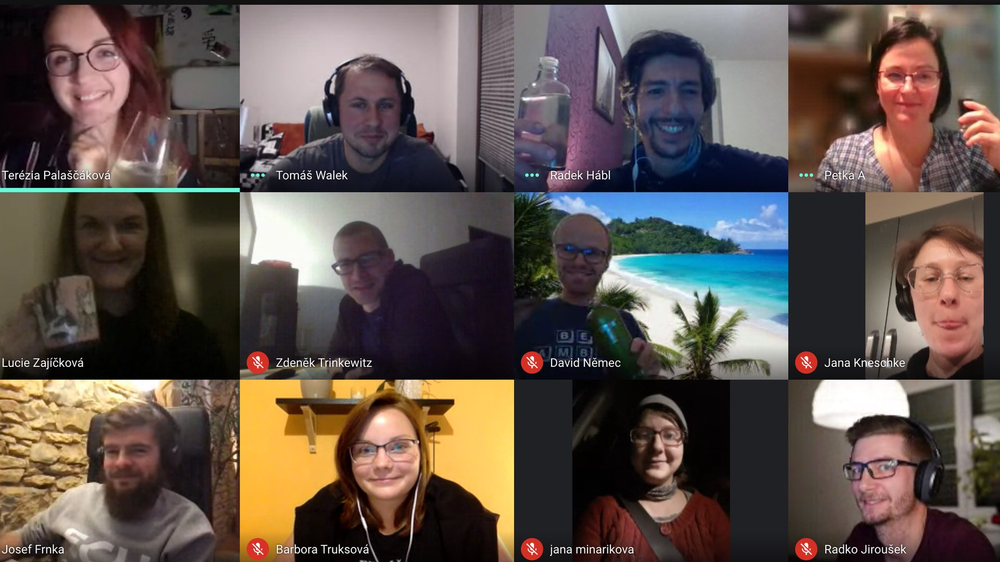
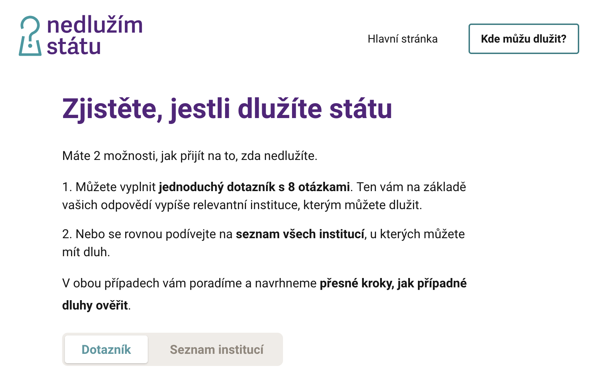

**Chápou problém, umí ho řešit a jejich vize přitahují dárce i dobrovolníky. Neziskové organizace mají zásadní roli v řešení společenských problémů a svou flexibilitou dokážou předběhnout politiky a jít pomoct do terénu, když to společnost zrovna potřebuje. Ve spojení s digitálními technologiemi však dokážou jejich projekty ještě větší věci. Pojďme si připomenout 3 neziskové organizace, které díky Česko.Digital posunuly svůj projekt na vyšší level.**

Díky technologiím se podařilo Výluce, Nadačnímu fondu nezávislé žurnalistiky a Institutu prevence a řešení předlužení řešit společenský problém ve svém oboru. 6 tisíc chybějících učitelů, 30 % neinformovaných voličů a miliardy, které dluží Češi státu. Tam všude přišli expertní dobrovolníci s technologickým řešením.

## Začni učit!

Spolek [Výluka, z. s.](https://vyluka.org/) mění školství odspoda tak, aby byl v českém školství **dostatek spokojených a motivovaných učitelů** – protože jen ti můžou mít spokojené a motivované žáky. Za Česko.Digital přišla Výluka s alarmující zprávou: **V Česku chybí šest tisíc pedagogů.** Řešením by mohla být platforma, kde by zájemci o tuto práci našli přehledné informace o zapojení se do školství. 

V rámci projektu Začni učit! tak vznikl kromě [základní webové stránky](http://zacniucit.cz) také [interaktivní průvodce](https://zacniucit.cz/pruvodce) **pedagogickými programy a kurzy na jednom místě**. Stačí do něj zadat své vzdělání a preference, na jakém stupni a jaký předmět byste rádi učili. Interaktivní průvodce na základě toho doporučí konkrétní tipy na kurzy na různých univerzitách. Takto koncentrované informace pomohou k šíření myšlenky, že **jít učit může být snadno realizovatelný nápad.**

Expertní dobrovolníci pracovali na informační architektuře, designu, vývoji webu, databáze a registračního systému, marketingu a rovněž realizovali výzkum. Podle odhadu Romany Pokorné, specialistky na projektové řízení v Česko.Digital, by **takový projekt v komerčním prostředí vyžadoval finance přesahující hranici jednoho milionu korun.**

Dobrovolníky motivovalo přesv**ědčení, že technologie mohou pomoci,** navíc zázemí komunity a projektové nastavení zaručuje, že se příchozí projekt dočká zdárného konce. 

A dopad? **Do dvou měsíců využilo interaktivního průvodce více než 1000 lidí**, kteří hledali pomoc s doplněním pedagogické kvalifikace. 

## Inovace zpravodajského storytellingu

**Třetina Čechů nečte zpravodajství**, přitom chodí k volbám a rozhodují o budoucnosti země, ukázal [výzkum](https://www.nfnz.cz/studie-a-analyzy/cesi-a-zpravodajstvi/) Nadačního fondu nezávislé žurnalistiky. Fond rovněž zpracoval studii poukazující na inovace v zahraničních redakcích, kterým se díky technologiím úspěšně podařilo přivést lidi zpátky ke zpravodajství. 

**Jak využít technologie k větší informovanosti Čechů v situaci, kdy jsou místní redakce relativně konzervativní** a k digitálním inovacím uzavřené, byla otázka, se kterou přišel tehdejší ředitel fondu, Josef Šlerka, za Česko.Digital.

Tým expertních dobrovolníků absolvoval ideační sprint a navrhl [prototypy](https://cesko-digital.atlassian.net/wiki/spaces/IZS/pages/818315356/V+sledky+projektu), které **dokazují, že inovace ve zpravodajství mají smysl.** Nápady ověřili se zástupci Google, Seznamu, technologických agentur a řady redakcí. Výsledky projektu jsou také **návody na technologické prototypy Chatbot Newsie a Témata pod lupou**, které si mohou redakce kdykoliv bezplatně nainstalovat a využívat ke své činnosti.

Přínosem komunity byla například **zpětná vazba expertních dobrovolníků na téma inovací a schopnost propojit se s nejdůležitějšími hráči na trhu** bez placené spolupráce. Součástí projektu bylo testování nápadů v provozu a tříměsíční cyklus design thinking workshopů, kam se společnými silami podařilo dostat již tak vytížené novináře.

## Nedlužím státu

**Čtvrtina Čechů dluží státním institucím desítky miliard korun** a často o tom ani neví. Jak tyto dluhy stát vymáhá je ale většině z nás neznámé a tak se stává, že nám nabíhají dluhy za nezaplacený odpad, pokuty za parkování nebo MHD či zdravotní a sociální pojištění. Proto přišel [Institut prevence a řešení předlužení, z.ú.](https://www.institut-predluzeni.cz/) za komunitou Česko.Digital s nápadem na informační a edukativní web.

Projekt prošel čtyřmi fázemi a celkem se do něj zapojilo přes 40 pro bono odborníků na user interface, user experience, analýzu dat, design, vývoj, marketing a výzkum. Dobrovolníci pracovali na návrhu webových stránek, provedli uživatelské testování a zprovoznili několik užitečných funkcí, jako je **dotazník**, který vám vypíše seznam institucí, kde můžete dlužit, **automatické generování formulářů** nebo pomůcky, které pomohou řešit případný zjištěný dluh (např. **žádost o splátkový kalendář či žádost o odpuštění penále**).

Iniciátor projektu **Radek Hábl** ve [videu na Youtube Česko.Digital](https://www.youtube.com/watch?v=3CoFXWExWxA&t=367s) popisuje, že **přínos komunity vidí zejména v angažovaném týmu**, který velmi dobře dokázal definovat základní verzi webové pomůcky, což byl do té doby problém. Expertní tým se totiž dokázal na pomůcku podívat jako na produkt, což projektu přineslo jasný směr a cíl. 

[Stránku Nedlužím státu](http://nedluzimstatu.cz) **navštívilo už více než 150 tisíc lidí**, z toho více než **25 tisíc lidí vyplnilo dotazník**, aby zjistili, kde dluží, a kolem **1 150 lidí požádalo o potvrzení bezdlužnosti.** Sám Radek Hábl si díky spolupráci s komunitou poprvé vyzkoušel agilní roli Product Ownera, kterou by se jinak musel učit na kurzech, které nejsou nejlevnější. 

