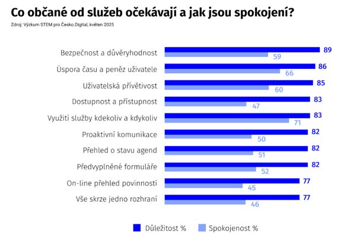

*David Klimeš: Pokračuji se sérií reakcí na debatu v newsletteru o stavu digitalizace veřejných služeb v Česku. Nyní se zapojují Jiří Táborský ze STEM a Blanka Šoulavá za Česko.Digital. Díky za to!*

„Stav digitalizace veřejných služeb v Česku má jednu společnou vlastnost s řadou dalších státních agend: prakticky každý si o tom něco myslí, ale najít někoho, kdo má názory datově podložené, není snadné. Vody teď nejnověji rozvířila [zpráva NKÚ o stavu digitalizace veřejné správy](https://www.nku.cz/cz/pro-media/tiskove-zpravy/padesat-miliard-na-projekty-digitalizace-nestacilo--stat-sliboval-od-roku-2025-plne-digitalni-sluzby--podarilo-se-to-jen-u-18--z-nich-id15329/), která konstatovala, že se v posledních cca 5 letech na rozvoj digitalizace vynaložilo kolem 50 miliard, a přitom jen každá pátá služba je plně digitální. Je příznačné, že prakticky neumíme říct, jestli jsme díky těmto investicím někde ušetřili, ať už na straně státu (lidi, čas apod.) na straně uživatelů nebo například jestli jsou občané a firmy se službami spokojenější.

Zároveň jak NKÚ upozorňuje, systematická analýza potřeb uživatelů veřejné správy ani samotných úředníků často není v jádru rozhodování. Pokusili jsme se proto v Česko.Digital a STEM vhled do stavu digitalizace v uplynulém roce prohloubit, a to skrze [největší výzkum digitalizace státních služeb](https://www.cesko.digital/projekty/sluzby-digital/home). Naším cílem bylo zjistit, kdo je spokojený, kdo ne, kde jsou největší problémy – a připravit doporučení, která by přispěla k úspěšnější digitalizaci.

Suma sumárum se dá říct, že směr, jakým jdeme, je v zásadě dobrý, ale máme velké příležitosti ke zlepšení. Ačkoliv lidé považují digitální služby za samozřejmost, spokojenost s celkovou úrovní digitalizace služeb státu vyjadřuje jen zhruba 40 % z nich. V rámci výzkumu jsme například vzali všechny hlavní vlastnosti, které podle vládních dokumentů mají služby mít, a zeptali jsme se lidí, jestli jsou pro ně důležité a jestli je služby státu opravdu mají. Ukázalo se, že klíčová z hlediska důležitosti je bezpečnost, ale i zbylé vlastnosti (v grafu níže) jsou dobře ukotveny a jsou pro uživatele důležité. Horší byl rozdíl mezi důležitostí a spokojeností. Ten je největší u přístupnosti, tj. dojmu, že služby jsou svou uživatelskou přívětivostí opravdu pro každého. Dnes zjevně nejsou. A navíc čím větší překážky v používání digitálních služeb člověk má (z hlediska vzdělání, zdravotního postižení, věku apod.), tím menší je jeho spokojenost.

A teď proč se digitalizovat moc nedaří. Podle lidí zevnitř systému máme potíž v tom, že nám chybí dvě věci: dlouhodobá kontinuita (tedy schopnost stanovit směr, a neměnit ho každé čtyři roky) a pak politická podpora (bez podpory od politiků se zákony samy neprosadí, platy se nezvýší, resortismus neodstraní atd.). K tomu nám chybí lidé. Stát nemá všechno dělat sám - zároveň ale platí, že redukce úředníků nutně neznamená úspory. Namísto toho vede často k většímu zapojení dražších externistů v klíčových rolích. Navíc jestliže nástupní plat na IT pozice ve státní správě připomíná mnohde nástupní plat na kasu v supermarketu, tak máme problém. Místo získání a udržení kvalitních lidí s know-how, kteří by na straně státu řídili digitalizační projekty, vytváříme stav, který je neefektivní ekonomicky, negativně dopadá na kvalitu a dostupnost služeb a zvyšuje bezpečnostní riziko plynoucí ze závislosti na outsoursování kritických znalostí. Tenhle problém konstatují i dodavatelské firmy, protože jim často na straně státu chybí partner k jednání.
\
Co si z toho odnést? Nejsme „spálená” digitální země, navíc v oblasti digitální transformace se dá posun udělat relativně rychle. Ukrajina to ukazuje: rozhodli se být nejpřívětivější digitální stát a za 6 let [poskočili 102. na 5. místo v r. 2024 v hodnocení OSN v oblasti digitálních služeb](https://publicadministration.un.org/egovkb/en-us/Data/Country-Information/id/180-Ukraine).\
\
Abychom se vydali podobným směrem, je potřeba stavět na aktuálním vládním programovém prohlášení a mít digitalizaci opravdu jako prioritu s měřitelnými cíli. V rámci toho zajistit, aby byl stát jako zaměstnavatel konkurenceschopný. A také nastavit řízení kvality služeb. Dnes jsme totiž ve stavu, kdy jediná upřímná odpověď, jak jsme na tom vlastně s digitalizací a kam jsme se posunuli, zní, že nevíme. Jak zaznělo v jednom z výzkumných rozhovorů: „stát nemá data ani na řízení sebe sama". A od toho by se mělo začít.

