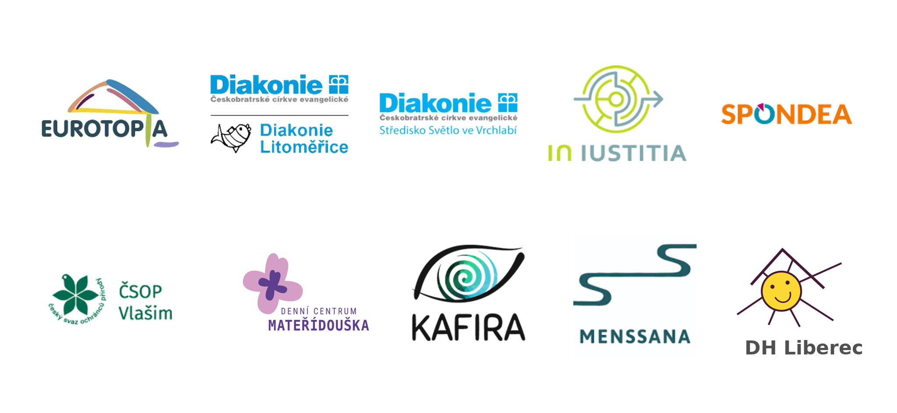

## **💻 Experti a expertky na digitalizaci: přidejte se do naší sítě**

Máte zkušenosti s digitalizací procesů, nástroji nebo automatizací a chcete je využít i pro reálnou pomoc organizacím, které mění Česko k lepšímu?

Hledáme další odborníky a odbornice do naší Expertní sítě – **dlouhodobé komunity, která pomáhá veřejně prospěšným organizacím** zorientovat se v současných možnostech a nakopnout jejich digitální transformaci.

Co z toho? Zkušenosti, pocit ze smysluplné pomoci, spolupráci s Česko.Digital jako položku do CV nebo nové klienty.

Jako dobrovolní experti*expertky byste se aktuálně zapojovali do naší nové služby [Konzultace s expertem na digitalizaci](https://www.cesko.digital/projekty/nezisk-digital/digitalni-expert?utm_source=mailing&utm_medium=email&utm_campaign=blog). Konzultace je jednorázová, trvá hodinu a je online.

Vaše zapojení je **časově flexibilní**. Termíny si domlouváte sami podle svých možností (většinou jde o jednotky hodin měsíčně). Pokud jste freelanceři, může být pro vás zajímavé, že na konzultaci můžete plynule **navázat placenou spoluprací**. Tu si domlouváte s organizací po vlastní ose.

Klíčová je **konzultační kompetence**, tedy dobře se ptát a pak navrhnout možná řešení (implementace není očekávanou součástí konzultací).

V Expertní síti se hodí **různé specializace** – od automatizací, integrací a low-code nástrojů až po pokročilé využití Google Workspace nebo Microsoft 365. Hodí se i přehled o SaaS nástrojích pro správu úkolů či kontaktů nebo zkušenosti s digitalizací financí a HR. Obecně jsme ale rádi za každého člověka, protože rozpětí poptávek je velké: od „nevím, jak se přihlásit do Google Admin Console“ po „chceme hostovat vlastní aplikaci na Google Cloud“.

👉 Chcete přinést své know-how tam, kde může mít skutečný dopad – a zároveň získat nové zkušenosti i kontakty? [Domluvte si online call s Matějem Malechou.](https://appt.link/matej-malecha/web-conference-30)

- - -

## **Hledá se tech-expert*ka na Make.com a AI automatizace**

Máte zkušenosti s **Make.com, automatizacemi nebo zapojením AI do workflow**? Přidejte se jako tech-expert*ka do našeho online kurzu Nezisk.Digital (jaro či podzim 2026) a pomozte veřejně prospěšným organizacím zjednodušit jejich každodenní fungování.

V kurzu organizace spolupracují s průvodci*průvodkyněmi a právě experty*expertkami, kteří jim pomáhají analyzovat jejich potřeby, doporučit a nastavit vhodné digitální nástroje a nastavit nové workflow tak, aby organizace ve výsledky šetřily energii a měly více času na své poslání.

👉 [Více informací na našem webu](https://app.cesko.digital/opportunities/recGLCcg5xF0wsi5e)

- - -

## **10 dalších organizací projde naší digitální proměnou**

Máme radost! Opět se našlo 10 veřejně prospěšných organizací, které na sobě chtějí intenzivně pracovat. V našem jarním [online kurzu Nezisk.Digital](https://www.cesko.digital/projekty/nezisk-digital/online-kurz-nezisk-digital?utm_source=mailing&utm_medium=email&utm_campaign=blog) zrevidují a zlepší své pracovní procesy i nástroje a ve výsledku ušetří čas, své lidi i peníze a také posílí svůj dopad navenek.

Začínají 7. dubna a jako vždy si jejich cestu a výsledný efekt kurzu nenecháme pro sebe. Organizace budete moci sledovat na **online Otevřených setkáních**, číst si jejich **případové studie** na našem blogu i procházet novou **inspirativní stránku jejich úspěchů**.

Letos kurz běží v novém modelu financování, kdy si organizace mohou kurzovné zajistit i z dalších zdrojů. Máme radost, že 9 z 10 jarních organizací **vstupuje do kurzu s grantovou podporou od Nadace ČEZ**.

Do jarního běhu kurzu vstupují: moravskoslezská **EUROTOPIA.CZ** (sociální podpora rodin a komunit), **Diakonie ČCE** – střediska Vrchlabí a Litoměřice (podpora lidí v náročné životní situaci), pražská a brněnská **In IUSTITIA** (právní podpora obětí předsudečného násilí), jihomoravská **Spondea** (psych. a soc.-právní podpora lidí v náročných životních situacích), **ZO ČSOP Vlašim** (ochrana přírodního a kulturního dědictví), karlovarské **Denní centrum Mateřídouška** (podpora lidí s mentálním, kombinovaným postižením a PAS postižením), moravskoslezská **Kafira** (podpora lidí se zrakovým postižením), ostravská **Menssana** (podpora duševního zdraví) a **DH Liberec** (podpora lidí s mentálním postižením).

Organizace podpoří tito skvělí **průvodci a průvodkyně**:
Martina Pokorná, Václav Trejdl, Karel Pešata, Lucie Jurystová, Pavel Suk, Adam Martinek, Jana Špačková, Martin Chmela, Pavel Cinkeis

A stejně skvělí **tech-experti a expertky**:
Jan Štefanides, Lukáš Souček, Hoang Doan, Honza Pobořil, Eva Hermanová, Iva Balhar, Čeňka Ryšlinková, Tomáš Navrátil

- - -

## **Nestihli jste jarní kurz? Stíháte podzimní!**

Jarní běh je už plný, ale v podzimním kurzu stále zbývá několik míst – konkrétně až 6. Podzimní běh proběhne od 1. 9. do 11. 12. 2026 a **přihlášky uzavíráme už 30. 4.** Více o online kurzu Nezisk.Digital [ZDE](https://www.cesko.digital/projekty/nezisk-digital/online-kurz-nezisk-digital?utm_source=mailing&utm_medium=email&utm_campaign=blog).

Kurzovné můžete opět financovat díky Nadaci ČEZ, tentokrát z [grantu Podpora regionů pro rok 2026](https://www.nadacecez.cz/cs/vyhlasovana-grantova-rizeni/podpora-regionu-110046).

Tentokrát je pole pro grantisty širší (financování je pro organizace z oblastí podpory dětí a mládeže, zdravotnictví, sociální péče, osob s handicapem, vědy, vzdělání, kultury, sportu nebo životního prostředí).

Zájemci a zájemkyně se mohou připojit na dobrovolné online setkání **Představujeme kurz Nezisk.Digital** – koná se 8. 4., ale registrovat se můžete už dnes! 👇

[Hlásíme se na online představení kurzu](https://airtable.com/appBMJcLnBva02IEy/shrRhqG8uH2S5z0Pt)

- - -

## **Aktuálně ve Služby.Digital**

V našem [projektu Služby.Digital](https://www.cesko.digital/projekty/sluzby-digital/home), který usiluje o lepší digitální služby státu, momentálně pracujeme:

* na tom, aby vláda měla měřitelné cíle a priority v návaznosti na programové prohlášení vlády
* na konkrétních návrzích v rámci tématu managementu kvality služeb

Chcete se k nám přidat se svou expertizou nebo nás podpořit jinak?
👉 [Rádi vás přivítáme mezi Hybatele digitálního Česka.](https://crm.cesko.digital/?entryPoint=leadCaptureForm&id=68b00b184635910d7)

- - -

## **👩‍💻 Ze světa digitalizace Česka**

### **Vyšel pětiletý audit digitalizace státu: co říká NKÚ a kudy dál?**

Nejvyšší kontrolní úřad v lednu vydal [souhrnnou pětiletou zprávu o stavu digitalizace Česka](https://www.nku.cz/cz/pro-media/tiskove-zpravy/padesat-miliard-na-projekty-digitalizace-nestacilo--stat-sliboval-od-roku-2025-plne-digitalni-sluzby--podarilo-se-to-jen-u-18--z-nich-id15329/). Je v ní spousta cenných dat a doporučení, které se v řadě oblastí protínají se závěry našeho reportu [Digitální stát na půl plynu.](https://assets.cesko.digital/5a55e59a.pdf)

V auditu NKÚ adresuje mimo jiné i hlavní bariéry úspěšné digitální transformace:

* Nedostatečné lidské zdroje
* Nenaplnění cílů a nízká ekonomická efektivita
* Strategické a koncepční nedostatky
* Právní, procesní a smluvní překážky
* Nízká úroveň řízení projektů a kvality
* Finančně náročná technická a provozní řešení
* Neúplnost dat a složité informační toky

Shrnující [video včetně našeho komentáře](https://www.youtube.com/watch?v=2jw2XX-9AXw) najdete na YouTube NKÚ.

### **RVIS reorganizována: předsedou je premiér Andrej Babiš**

Vláda schválila [nový nový statut Rady vlády pro informační společnost (RVIS)](https://vlada.gov.cz/assets/ppov/rvis/Statut-Rady-vlady-pro-informacni-spolecnost.pdf), který má radě pomoci fungovat rychleji a efektivněji. Předsedou se stal premiér Andrej Babiš. Spolu s ním bude radu řídit menší tým místopředsedů a výkonné grémium, které se bude scházet každý měsíc. Teď je podle nás klíčové, aby byly stanoveny jasné cíle ([vyplývající z programového prohlášení vlády](https://vlada.gov.cz/cz/vlada/programove-prohlaseni/programove-prohlaseni-vlady-224629/#digitalizace)), které půjde měřit. A také aby bylo zřejmé, kdo za jejich plnění nese odpovědnost a v jakém harmonogramu.

### **Známe hlavní tváře digitalizace nové vlády**

[Zmocněncem pro digitalizaci a strategickou bezpečnost se v lednu stal poslanec ANO, Robert Králíček](https://vlada.gov.cz/cz/ppov/zmocnenci_vlady/vladni-zmocnenec-pro-digitalizaci-a-strategickou-bezpecnost-224824/). Na společné schůzce jsme mluvili o hlavních prioritách vlády v oblasti digitalizace služeb pro nadcházející rok a možné spolupráci na tématu managementu kvality služeb.

Další důležitou osobností současné vlády v oblasti digitalizace je potom **náměstek ministra vnitra Lukáš Klučka**, který také [zahajoval březnovou konferenci Digitální Česko](https://www.digitalni-cesko.eu/), kde mluvil o hlavních prioritách vlády.

Vláda také jmenovala **vládním zmocněncem pro AI bývalého šéfa prg.ai Lukáše Kačenu**, což je důležité i v návaznosti na řadu úkolů, které vyplývají z nově schválené [Hospodářské strategie pro oblast digitalizace služeb státu](https://mpo.gov.cz/strategie).

### **STEM/MARK pro DIA: Jak digitalizaci státu vnímá veřejnost?**

Podle [výzkumu veřejného mínění, který pravidelně zadává DIA](https://www.dia.gov.cz/cs/aktuality/dve-tretiny-cechu-davaji-prednost-digitalni-komunikaci-se-statem#:~:text=65%25%20obyvatel%20%C4%8Cesk%C3%A9%20republiky%20dnes%20p%C5%99i%20komunikaci%20se%20st%C3%A1tem%20preferuje), například vyplývá, že:

* digitální komunikaci s úřady dnes upřednostňuje 65 % respondentů a 69 % uvádí, že jim digitalizace usnadňuje život
* 47 % si myslí, že se digitalizace posouvá správným směrem.
* plně digitalizováno je zatím 42 % všech služeb státu. [Do února 2027 mají být digitalizované všechny služby](https://ct24.ceskatelevize.cz/clanek/domaci/vlada-chce-do-roka-digitalizaci-vsech-sluzeb-statu-371264) (s výjimkou nepřiměřené zátěže)

DIA ušetřila státu 773 milionů korun (dle [zprávy o její činnosti za rok 2025](https://www.dia.gov.cz/cs/aktuality/zprava-o-cinnosti-dia-2025-agentura-usetrila-statu-773-milionu-a-zrychlila-digitalizaci)). Důvodem je revize projektů a eliminace jejich duplicit Odborem hlavního architekta e-Governmentu.

Výzkum DIA jsme okomentovali 4. 3. na ČRo Plus (ve 14:20) a na Radiožurnálu (v 15:20).

### **Vláda schválila finální podobu [Hospodářské strategie](https://mpo.gov.cz/strategie)**

Vítáme jasný harmonogram a rozdělení úkolů mezi konkrétní aktéry v oblasti digitalizace státu. Rezervy máme vůči některým posunutým termínům v oblasti digitalizace, ke kterým by z našeho pohledu nemělo docházet už ve fázi strategického plánování.

### **DIA má nového ředitele**

V pondělí 9. března vláda odvolala ředitele Digitální a informační agentury Petra Kuchaře, kterého nahradí dosavadní ředitel Odboru informačních technologií a komunikací Bohdan Urban. Petrovi Kuchařovi děkujeme za spolupráci.

## **📰 Z médií**

* V [posledním newsletteru ekonomického komentátora Davida Klimeše](https://davidklimes.cz/newsletter/273) nám vyšel komentář k aktuální digitalizaci státu. [Čtěte ho na našem blogu](https://blog.cesko.digital/2026/03/klimes-taborsky-soulava).
* [Síť na obranu demokracie](https://www.ochranademokracie.cz/) vydala svou [zprávu o stavu demokracie v ČR](https://tinyurl.com/Zprava2025) včetně Demometru za rok 2025. Obsahuje kapitoly o veřejné správě a občanské společnosti.

- - -

## **🔭 Akce na obzoru**

### **středa, 8. 4. | Představujeme online kurz Nezisk.Digital**

otevřené online setkání nejen pro zájemce o podzimní kurz Nezisk.Digital. Probereme to hlavní ohledně vaší možné účasti i dotazy, které vás zajímají.

👉 [Registrujte si místo už teď](https://airtable.com/appBMJcLnBva02IEy/shrRhqG8uH2S5z0Pt).

### **červen (datum teprve ohlásíme) | Showcase Digitální & odolnější**

představíme náš dlouho připravovaný dokument popisující, jak díky digitalizaci posílit kapacity a profesionalizaci veřejně prospěšných organizací a také odolnost české společnosti. Setkání bude online.

- - -

## **IT Fitness Test startuje. A hledá i nové posily do týmu**

Do dalšího ročníku IT Fitness Testu se právě hledají dobrovolníci a dobrovolnice do kreativního a komunikačního týmu. Je to příležitost, jak získat zkušenosti na větším projektu, který má reálný dopad na debatu o digitálním vzdělávání.

A už 18. března startuje samotný [IT Fitness Test 2026](https://itfitness.eu/cs/) – největší bezplatné online testování digitálních dovedností pro žáky, studenty i pedagogy v Česku. V minulém ročníku se zapojilo přes 63 000 lidí. Test je zdarma a školy ho zvládnou **během jedné vyučovací hodiny**. Zapojit se může kdokoliv i mimo školy až do 31. října. Podrobnosti najdete na [webu IT Fitness Testu](https://itfitness.eu/cs/).

- - -

Náš spřátelený Svět neziskovek nabízí nový intenzivní e-learning, který je **nejkomplexnějším online balíčkem fundraisingového know-how** v ČR i SR. Mix videí, textů a case studies, které se vám budou hodit pro úspěšný fundraising ve své organizaci. Na kurzu pracovalo 12 expertů a expertek po celý rok. Bude to stát za to!

👉 [Více o e-learningu Světa Neziskovek](https://onlineproneziskovky.thinkific.com/courses/jak-na-uspesny-fundraising?utm_source=partneri&utm_medium=affiliate&utm_campaign=FRe-learning&utm_content=fundraising%2C+e-learning)

- - -

## **Hledáte pomoc nebo radu pro svou organizaci?**

👉 [Zamiřte na naše Tržiště](https://trziste.diskutuj.digital/)

- - -

## **Diskutujte s námi o digitalizaci Česka!**

Digitální transformace státu, nástroje, inovace i podpultovky. Pojďte se bavit o všem, co souvisí s digitální současností i budoucností Česka.\

👉 **Aktuální témata na fóru [Diskutuj.Digital](https://diskutuj.digital/)**

- - -

## **Volné pozice v Česko.Digital**

Dobrovolné i profi
na pár hodin i na full-time
\
👉[Není mi to volné!](https://app.cesko.digital/opportunities)

- - -

### Děkujeme, že vás baví číst.digital!

Chcete, aby vám tento newsletter chodil do e-mailové schránky? [Přihlaste se k jeho odběru](https://ceskodigital.ecomailapp.cz/public/form/6-3fdfd544852ed7431aa64f3b9481afb9).

Dávají vám naše aktivity smysl? Moc nám pomůžete, když je budete sdílet dál. 

Děkujeme a digitálu zdar!

